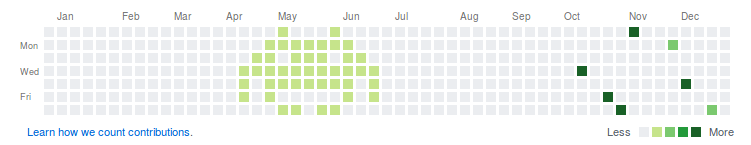

# Playing with contributions panel

## Goal

It's not the first time I meet a person who is worried about GitHub contributions panel.

This repository is my way to tell:

> Please, relax and enjoy.

## How it works

You need to choose a Sunday (eg. 10th of April, 2016)

```
$> ./scripts/create-space-invader.sh '04/10/2016'
```

If it has no execution permission:

```
$> chmod +x ./scripts/create-space-invader.sh
``` 

## Result

I have a space invader in 2016:


